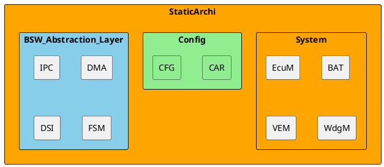

# Detailed Design Document

| **Author**              | `Zeina mohamed elfar & Jumana mohamed hamed`                                       |
|:------------------------|:-----------------------------------------------------|
| **Status**              | `Approved`                          |
| **Version**             | `1.0`                                                |
| **Date**                | `13/11/2024`                                         |

## Introduction

Provide an overview of the entire document:

* Identify the system/product using any applicable names and/or version numbers.

### Purpose
This low-level design specification describes the internal structure and the functions of the software module. It describes the interaction, data structures, specific embedded constraints and background information about design. This specification is the basis for coding and is an input document for the corresponding module test specification. The terms Low-level design specification and module specification are used interchangeably in Valeo to refer to documents of this type.

### Scope
Explanation:-
* Give information on project context, where this document applies.
* Also a reference for more project information can be given.
* Classification for P2, P1, and P0. shall be given.

### Defnitions and Acronym
| **Abbreviation** |             **Meaning**             |
|:----------------:|:-----------------------------------:|
|      (RT)OS      |    (Real-Time) Operating System     |
|       API        |    Application Program Interface    |
|       CDD        |      Component Design Document      |
|       HWI        |         HardWare Interfaces         |
|       NVM        |         Non Volatile Memory         |
|       SRS        | Software Requirements Specification |

## Architectural Overview

This section describes where this module resides in the context of the software architecture

## Functional Description
The following chapter describes the software functionality.  The following is a list of suggested sections to be considered for inclusion.

## Implementation of the Module
This chapter discusses the detailed design of the module.

## Integration and Configuration
### Static Files
Typically a module consists of C and H files but other file types may exist. List all files that form this module

| File name | Contents                             |
|-----------|--------------------------------------|
| Lcd.h     | lcd header file containing lcd functions |
| Lcd.ino   | all lcd initlizations and functions included                                     |
| adc.h     | adc header file containing  adc functions |
| adc.ino   | all adc initlizations and functions included |
|mainapp.ino| includs functions from other files and is where main code is located the makes the project function|

### Configuration
Any required hardware/software or system configuration that can be adjusted a header file shall be detailed in this section. This can be placed in the table below.
| Name | Value range | Description |
|------|-------------|-------------|
| upper tempereture limit |  0- infinite but limited by free charecter spaces on the lcd | this is the  maximum and minimum value range that the upper temperature limit can be set as|
| lower tempereture limit |  0- infinite but limited by free charecter spaces on the lcd    | this is the maximum and minimum value range that the lower temperature limit can be set as|

