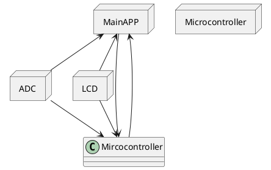
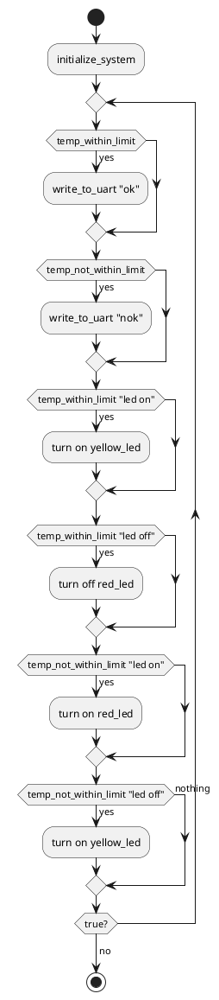

# Detailed Design Document

| **Author**              | `Zeina mohamed elfar & Jumana mohamed hamed`                                       |
|:------------------------|:-----------------------------------------------------|
| **Status**              | `Approved`                          |
| **Version**             | `1.0`                                                |
| **Date**                | `13/11/2024`                                         |

## Introduction

This report explains how to build a simple 16x2 LCD screen system that shows temperature readings from a sensor. Users can set high and low temperature limits using pushbuttons, and an LED light turns on when the temperature is within this desired range, and a second LED will turn on when the temperature is out of range. These act as indicators of whether the conditions are met and therefore normal or not. The system uses an ADC to read the temperature, and the software, written in C, controls how the data is shown on the screen and responds to the button inputs. Included in the project is a bill of materials, including an optimized one, a circuit diagram, code details, along with test cases to show how it works. A video is also provided to thoroughly explain the aim of the project, the circuit components and connections, the code, and to show the project as it is functioning.

### Purpose
The purpose of this design file is to describe the internal structure of the files of the software module, and the interactions between the files. It also describes the interaction, data structures, specific embedded constraints and background information about design. The aim and functionality of the project will also be explored. This file includes the architectural overview, functional direction, implementation of the module, and finally integration and configuration. 

### Scope
For this project, a circuit was conduct that consists of an LCD, Arduino board, LEDs, resistors, pushbuttons, and an LM35 temperature sensor. The code is written to conduct the following functions. Once the code is run the functionality of the circuit is as follows. Firstly The temperature sensor will detect the temperature of the surrounding climate, this temperature will then be displayed on to the LCD. on the LCD the upper and lower limits will also be displayed, as well as the words ‘ok’ or ‘Nok’ depending on if the temperature is in range or not. To start off with, once the code is first run, the lower and upper limits are not set, therefore the to begin with the LED is out of range, so ‘Nok’ is displayed on the screen and the red LED is turned on, if the temperature is in range of the upper and lower limit then the yellow LED will be turned on and the LCD will display ‘ok’. There are two push buttons within the circuit to control the upper and lower limits. By pressing the buttons the lower and upper limits are increase by increments of 5, this allows the user to control the upper and lower limits as they wish. There is also a button on the LCD that resets the power to the system. The user can then press this button and by resetting the power in the system the upper and lower limits will then automatically reset. 

### Defnitions and Acronyms
| **Abbreviation** |             **Meaning**             |
|:----------------:|:-----------------------------------:|
|     ADC          |   Anolog to digital converter       |
|     LDC          |  liquid crystal display             |
|     LED          |  light emitting diode                |
|     LM35         |  temp measuring device with an anolog output of voltage proportional to the temp|          |

## Architectural Overview

This section describes where this module resides in the context of the software architecture

## Functional Description
The code uses the values of the analog sensor, this value is then compared to an upper and lower limit that is set using two push buttons, and the results are then set on the LCD screen. The LCD and ADC interfaces read analog values that are obtained from the sensors that connected to the ADC channels. That data obtained is then samples and displayed on the LCD. The limit values for the upper and lower temperature limits are set as said before using push buttons and this sends the data to an external monitor in real time. The code sets the LCD and ADC modules and their starting values for the limits and the pins are al set as inputs and the pull up resistors for the buttons. When looking at the sensor, it can be explained as the following, the code reads the values from the ADC and then takes it and turns it into a string and this is how the values are able to be shown on the LCD. depending on if the code detects if the value from the temperature sensor is within range or not it will display ‘ok’ or ‘nok’ on the LCD.

## Implementation of the Module

ADC Initialization: Sets up the ADC for the designated channels.

LCD Display Functions: Shows the sensor type, current reading, and threshold limits.

This circuit uses Arduino to portray analog to digital conversion and the displays the digital signals then on the LCD, the circuit uses an LM35 temperature sensor and an LCD screen, buttons and LEDs. The LEDs are used as indicators on if the limits are in range or not and indicators for the main handwear components. The Arduino processes the LM35s anolog value input signal and this digital reading and user set limits are shown on the 16x2 LCD display screen almost immediately. The system is constantly reading the LM35s output and checks if the value is within the limit using the ADC. This system is close to simulating real world control systems in a system where the weather is controlled, such as an AC system. the whole system created would be very useful in an AC system. The temperature sensor would be very useful for to be used as a method of determining if the surrounding temperatures within the limit that the user has set. If the user sets that the AC provide a required temperature of 25 degrees, then the temperature sensor will check the existing temperature compared to the limit that the user has send and adjust accordingly. 

## assignment fowchart

## Integration and Configuration
### Static Files

| File name | Contents                             |
|-----------|--------------------------------------|
| Lcd.h     | LCD header file containing lcd functions |
| Lcd.ino   | all LCD initialization and functions included                                     |
| adc.h     | adc header file containing  adc functions |
| adc.ino   | all adc initialization and functions included |
|mainapp.ino| includes functions from other files and is where the main code is located the makes the project function|

### Configuration

| Name | Value range | Description |
|------|-------------|-------------|
| upper temperature limit |  0- infinite but limited by free character spaces on the LCD | This is the  maximum and minimum value range that the upper temperature limit can be set as|
| lower temperature limit |  0- infinite but limited by free character spaces on the LCD    | This is the maximum and minimum value range that the lower temperature limit can be set as|

