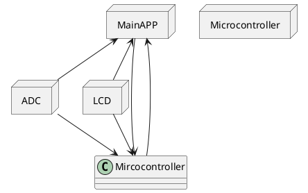

# Detailed Design Document

| **Author**              | `Zeina mohamed elfar & Jumana mohamed hamed`                                       |
|:------------------------|:-----------------------------------------------------|
| **Status**              | `Approved`                          |
| **Version**             | `1.0`                                                |
| **Date**                | `13/11/2024`                                         |

## Introduction

This report explains how to build a simple 16x2 LCD screen system that shows temperature readings from a sensor. Users can set high and low temperature limits using pushbuttons, and an LED light turns on when the temperature is within this desired range, and a second LED will turn on when the temperature is out of range. These act as indicators of whether the conditions are met and therefore normal or not. The system uses an ADC to read the temperature, and the software, written in C, controls how the data is shown on the screen and responds to the button inputs. Included in the project is a bill of materials, including an optimized one, a circuit diagram, code details, along with test cases to show how it works. A video is also provided to thoroughly explain the aim of the project, the circuit components and connections, the code, and to show the project as it is functioning.

### Purpose
This low-level design specification describes the internal structure and the functions of the software module. It describes the interaction, data structures, specific embedded constraints, and background information about design. This specification is the basis for coding and is an input document for the corresponding module test specification. The terms Low-level design specification and module specification are used interchangeably in Valeo to refer to documents of this type.

### Scope
For this project, a circuit was conducted that consists of an LCD, Arduino board, LEDs, resistors, pushbuttons, and an LM35 temperature sensor. The code is written to conduct the following functions. Once the code is run the functionality of the circuit is as follows. Firstly The temperature sensor will detect the temperature of the surrounding climate, this temperature will then be displayed onto the LCD. On the LCD the upper and lower limits will also be displayed, as well as the words ‘ok’ or ‘Nok’ depending on if the temperature is in range or not. To start with, once the code is first run, the lower and upper limits are not set, therefore to begin with the LED is out of range, so ‘Nok’ is displayed on the screen, and the red LED is turned on, if the temperature is in range of the upper and lower limit then the yellow LED will be turned on and the LCD will display ‘ok’. There are two push buttons within the circuit to control the upper and lower limits. By pressing the buttons the lower and upper limits are increased by increments of 5, this allows the user to control the upper and lower limits as they wish. There is also a button on the LCD that resets the power to the system. The user can then press this button and by resetting the power in the system the upper and lower limits will then automatically reset. 

### Defnitions and Acronyms
| **Abbreviation** |             **Meaning**             |
|:----------------:|:-----------------------------------:|
|     ADC          |   Anolog to digital converter       |
|     LDC          |  liquid crystal display             |
|     LED          |  light emitting diode                |
|     LM35         |  temp measuring device with an anolog output of voltage proportional to the temp|          |

## Architectural Overview

This section describes where this module resides in the context of the software architecture

## Functional Description
The following chapter describes the software functionality.  The following is a list of suggested sections to be considered for inclusion.

## Implementation of the Module
This chapter discusses the detailed design of the module.

## Integration and Configuration
### Static Files
Typically a module consists of C and H files but other file types may exist. List all files that form this module

| File name | Contents                             |
|-----------|--------------------------------------|
| Lcd.h     | LCD header file containing lcd functions |
| Lcd.ino   | all LCD initialization and functions included                                     |
| adc.h     | adc header file containing  adc functions |
| adc.ino   | all adc initialization and functions included |
|mainapp.ino| includes functions from other files and is where the main code is located the makes the project function|

### Configuration
Any required hardware/software or system configuration that can be adjusted in a header file shall be detailed in this section. This can be placed in the table below.
| Name | Value range | Description |
|------|-------------|-------------|
| upper temperature limit |  0- infinite but limited by free character spaces on the LCD | This is the  maximum and minimum value range that the upper temperature limit can be set as|
| lower temperature limit |  0- infinite but limited by free character spaces on the LCD    | This is the maximum and minimum value range that the lower temperature limit can be set as|

